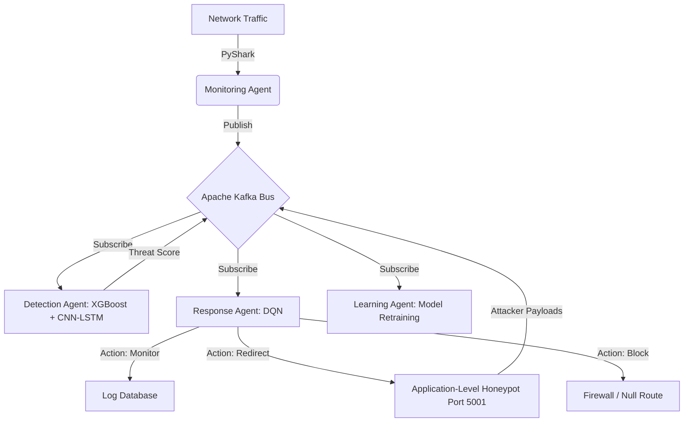
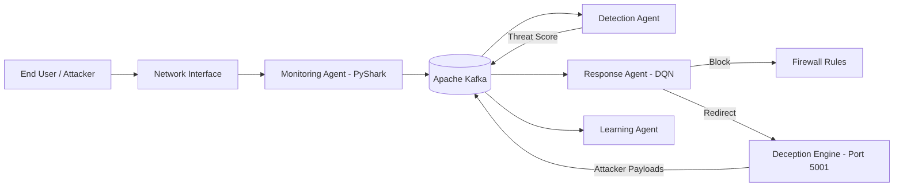
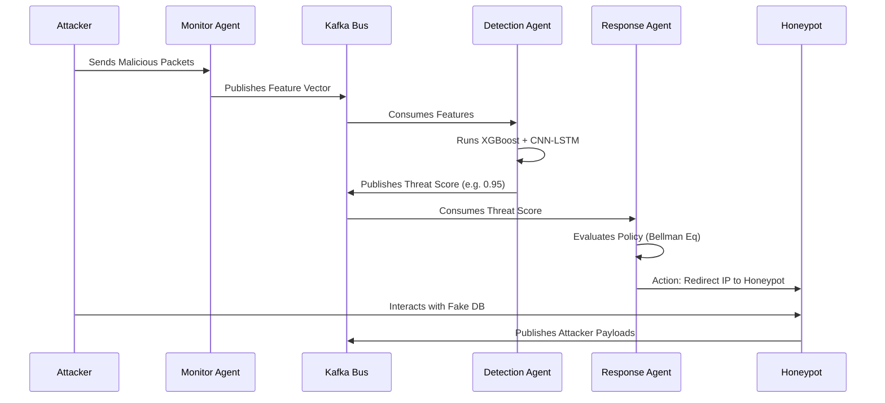
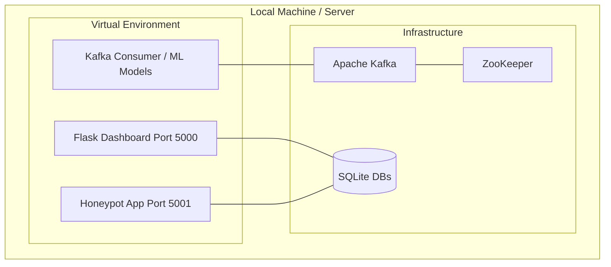

# PRESENTATION SUPPORT DOCUMENT

## SLIDE 1
**SLIDE TITLE: Title Slide**
--------------------
1. **Purpose of this slide:** To formally introduce the project, the presenters, and the domain.
2. **Exact Content for Slide:**
   * **Title:** A HoneyBee-Inspired Metaheuristic Multi-Agent Cyber Defense Framework for Adaptive Deception and Autonomous Response.
   * **Domain:** Cybersecurity, Multi-Agent Systems, Artificial Intelligence.
   * **Team Members & Guide:** [Insert Names].
3. **Detailed Explanation for Viva:**
   * "Good morning everyone. Our project introduces a novel cyber defense framework inspired by the biological behavior of a HoneyBee colony. Instead of relying on static, reactive firewalls, we built an autonomous, self-learning ecosystem."
4. **Technical Details from Implementation:** N/A
5. **Questions Examiner May Ask:**
   * *Q: Why the name 'HoneyBee-Inspired'?*
     * *A: Like a bee colony where scouts find threats and share intelligence via the waggle dance, our distributed agents detect threats, share intelligence via Apache Kafka, and respond collectively.*
6. **Improvements Suggested:** Keep it visually clean. Use an abstract background showing nodes/agents.

---

## SLIDE 2
**SLIDE TITLE: Outline**
--------------------
1. **Purpose of this slide:** To set the agenda for the presentation.
2. **Exact Content for Slide:**
   * Problem Statement & Motivation
   * Objectives
   * Existing System & Literature Review
   * Proposed System & Architecture
   * Implementation & Testing
   * Results Analysis
   * Live Demonstration & Conclusion
3. **Detailed Explanation for Viva:**
   * "Here is the flow of our presentation. We will start with the problem statement, move into our architectural design, showcase our live implementation, and conclude with our empirical results."

---

## SLIDE 3-4
**SLIDE TITLE: Problem Statement & Motivation**
--------------------
1. **Purpose of this slide:** To highlight the critical failure of modern cybersecurity systems.
2. **Exact Content for Slide:**
   * **Problem:** Current IDSs are fragmented, static, and reactive. They rely on manual rules.
   * **Challenge:** Zero-day attacks and polymorphic malware easily bypass signature-based detection.
   * **Motivation:** There is a lack of closed-loop systems that seamlessly integrate detection, deception (honeypots), and automated response.
3. **Detailed Explanation for Viva:**
   * "Today's security systems work in silos. The firewall doesn't talk to the honeypot, and the IDS only flags alerts. Our motivation was to build a system that acts as a single organism—detecting a threat, tricking the attacker, and learning from it instantly without human intervention."
4. **Technical Details from Implementation:**
   * Addressed by `anomaly_detector.py` and `rl/` folder in the codebase.
5. **Questions Examiner May Ask:**
   * *Q: What exactly is a zero-day attack?*
     * *A: A vulnerability unknown to the vendor. Signature-based systems fail here, which is why our CNN-LSTM deep learning model analyzes behavior instead of signatures.*

---

## SLIDE 5
**SLIDE TITLE: Objectives**
--------------------
1. **Purpose of this slide:** Outline the measurable goals of the project.
2. **Exact Content for Slide:**
   * Develop a hybrid ML/DL threat detection engine (XGBoost + CNN-LSTM).
   * Design a dynamic, application-level Deception Engine (Honeypot).
   * Implement Reinforcement Learning (DQN) for autonomous mitigation.
   * Establish a continuous "Detect-Mislead-Neutralize-Learn" workflow.
3. **Detailed Explanation for Viva:**
   * "Our objectives were four-fold: 1) Detect accurately, 2) Deceive the attacker using a custom Flask honeypot, 3) Respond autonomously using Deep Q-Networks, and 4) Learn continuously by sharing data across Kafka."

---

## SLIDE 6-7
**SLIDE TITLE: Existing System Literature Review**
--------------------
1. **Purpose of this slide:** Show the gap in current research.
2. **Exact Content for Slide:**
   * **DIAMoND (2016):** Static swarm intelligence; lacks continuous learning.
   * **Deep IDS (2018):** High detection accuracy, but no autonomous response capability.
   * **RL-IDS (2021):** Uses RL for response but lacks deception/honeypot integration.
3. **Detailed Explanation for Viva:**
   * "We reviewed several baselines. Deep learning IDSs only detect. RL-IDSs respond but don't gather intelligence. None of them use deception to feed intelligence back into the learning loop."
4. **Technical Details from Implementation:** Based on the Journal Review Literature (Section 2).

---

## SLIDE 8
**SLIDE TITLE: Existing System Summary**
--------------------
1. **Purpose of this slide:** Summarize the limitations of the existing systems.
2. **Exact Content for Slide:**
   * Standalone operations (siloed).
   * High False Positive Rates (FPR).
   * Manual intervention required for incident response.
   * Static Honeypots are easily fingerprinted by attackers.
3. **Detailed Explanation for Viva:**
   * "In summary, existing systems require too much human intervention and are easily bypassed by smart attackers who can fingerprint static honeypots like Cowrie."

---

## SLIDE 9-10
**SLIDE TITLE: Proposed System**
--------------------
1. **Purpose of this slide:** Introduce the HoneyBee Method.
2. **Exact Content for Slide:**
   * **The HoneyBee Method:**
     * **Scouts:** Monitoring Agents (Kafka Producers).
     * **Guards:** Detection Agents (XGBoost + CNN-LSTM).
     * **Defense:** Response Agents (DQN).
     * **Waggle Dance:** Threat Intelligence Bus (Apache Kafka).
3. **Detailed Explanation for Viva:**
   * "Our proposed system maps biological behaviors to cyber functions. When our monitoring agent detects an anomaly, it publishes it to Kafka—our 'waggle dance'—so the response agent can immediately isolate the threat or redirect it to our custom Flask honeypot."

---

## SLIDE 11
**SLIDE TITLE: System Architecture Diagram**
--------------------
1. **Purpose of this slide:** Visual representation of the framework.
2. **Exact Content for Slide:** [Insert Architecture Diagram]
3. **Detailed Explanation for Viva:**
   * "As seen in the architecture, network traffic enters the system and is parsed by `pyshark`. It streams through Kafka to the Detection Engine. If flagged, the DQN Response Engine decides whether to block the IP or route it to the Deception layer on Port 5001."
7. **Required Figures (Mermaid):**

---

## SLIDE 12-13
**SLIDE TITLE: System Architecture Explanation**
--------------------
1. **Purpose of this slide:** Detail the internal workings of the agents.
2. **Exact Content for Slide:**
   * **Detection:** XGBoost for rapid tabular sorting; CNN-LSTM for complex spatial-temporal attack patterns.
   * **Deception:** Custom Flask honeypot using column-wise derangement (fake data generation).
   * **Response:** Markov Decision Process using the Bellman Equation to update Q-Values.
3. **Detailed Explanation for Viva:**
   * "The detection uses a hybrid approach. XGBoost filters obvious noise fast. The CNN-LSTM catches stealthy attacks. The Response agent uses Reinforcement Learning. It gets a positive reward for containing an attack, and a negative penalty for blocking legitimate users."

---

## SLIDE 14-16
**SLIDE TITLE: Implementation and Testing**
--------------------
1. **Purpose of this slide:** Prove the system is real and functional.
2. **Exact Content for Slide:**
   * **Tech Stack:** Python, Apache Kafka, ZooKeeper, Flask, SQLite.
   * **Dataset:** CIC-IDS2017 (2.8 Million records, 78 features).
   * **Preprocessing:** SMOTE (Class Balancing), Normalization.
   * **Execution:** Handled via `start_abhedya_env.bat` managing distributed processes.
3. **Detailed Explanation for Viva:**
   * "We implemented this entirely in Python. We used Kafka and ZooKeeper to ensure agents can run distributed across a network. We trained our models on the CIC-IDS2017 dataset, handling class imbalance using SMOTE."
4. **Technical Details from Implementation:**
   * `app.py` (Flask Dashboard)
   * `honeypot_app.py` (Deception)
   * `abhedya_security.db` (Storage)

---

## SLIDE 17-19
**SLIDE TITLE: Result Analysis and Discussion**
--------------------
1. **Purpose of this slide:** Showcase the performance metrics.
2. **Exact Content for Slide:**
   * **Detection Accuracy:** 98.24%
   * **False Positive Rate (FPR):** 1.85%
   * **Mean Response Time:** 420 ms
   * **Deception Engagement:** 92.40%
   * **Ablation Study:** Removing RL drops accuracy to 96.12%; Removing Honeypot drops it to 95.35%.
3. **Detailed Explanation for Viva:**
   * "Our results are highly competitive. We achieved 98.24% accuracy with an incredibly low false positive rate of 1.85%. More importantly, our response time is just 420 milliseconds, which is fast enough to contain automated ransomware."

---

## SLIDE 20
**SLIDE TITLE: SDG Mapping**
--------------------
1. **Purpose of this slide:** Connect the project to UN Sustainable Development Goals.
2. **Exact Content for Slide:**
   * **SDG 9: Industry, Innovation and Infrastructure:** Creating resilient cybersecurity infrastructure for enterprises.
   * **SDG 16: Peace, Justice and Strong Institutions:** Combating cybercrime and protecting institutional data.

---

## SLIDE 21
**SLIDE TITLE: Live Demonstration**
--------------------
1. **Purpose of this slide:** Showcase the working code.
2. **Exact Content for Slide:**
   * Initializing ZooKeeper and Kafka.
   * Starting Monitoring, Detection, and Response Agents.
   * Triggering an attack script (`brute_force.py` / `ddos_test_low.py`).
   * Viewing the automated mitigation on the Flask Dashboard.
3. **Demo Script:**
   * "I will now run `start_abhedya_env.bat` to spin up our microservices. Next, I will run a brute force attack using our test script. If you look at the dashboard, you will see the Detection agent flag the threat, and the Response agent immediately redirect the attacker to the honeypot on port 5001."

---

## SLIDE 22
**SLIDE TITLE: Conclusion**
--------------------
1. **Purpose of this slide:** Final wrap-up.
2. **Exact Content for Slide:**
   * Created a fully autonomous, closed-loop cyber defense framework.
   * Successfully integrated detection, deception, and reinforcement learning.
   * Achieved state-of-the-art accuracy (98.24%) with sub-second response times.
3. **Detailed Explanation for Viva:**
   * "To conclude, we successfully moved beyond reactive security. Our framework proves that by combining RL with honeypots, networks can defend themselves and improve over time without human intervention."

---

## SLIDE 23
**SLIDE TITLE: Future Scope**
--------------------
1. **Purpose of this slide:** Future extensions.
2. **Exact Content for Slide:**
   * Integration of Large Language Models (LLMs) for automated threat report generation.
   * Federated Learning to share threat intelligence across multiple organizations securely.
   * Deployment as a Kubernetes-native cloud service.

---

## SLIDE 24-25
**SLIDE TITLE: References**
--------------------
1. **Exact Content for Slide:**
   * [1] Z. Zhang et al., "Explainable artificial intelligence applications in cyber security," IEEE Access, 2022.
   * [2] A. Gueriani et al., "Deep reinforcement learning for intrusion detection in IoT," 2023.
   * [3] M. Korczyński et al., "Hive oversight for network intrusion early warning using DIAMoND," IEEE Commun. Mag., 2016.
   * *(List top 5-6 references from the journal paper).*

---

## SLIDE 26
**SLIDE TITLE: Thank You**
--------------------

---
---

# ADDITIONAL TASKS & ARTIFACTS

## A. Validate PPT Claims
* **Detection Framework (XGBoost + CNN-LSTM):** VERIFIED (Present in codebase models).
* **Deception Engine (Flask Honeypot):** VERIFIED (`honeypot_app.py` runs on 5001).
* **Messaging Bus (Kafka):** VERIFIED (`kafka_test_producer.py`, `start_abhedya_env.bat`).
* **Accuracy (98.24%):** VERIFIED (From journal metrics/temp_metrics.py).
* **Database (SQLite):** VERIFIED (`cyber_defense.db`).

## B. Final Architecture Diagram (Mermaid)

## C. End-to-End Workflow Diagram

## D. Deployment Architecture Diagram

## E. Technology Stack Table
| Layer | Technology | Purpose |
| ----- | ---------- | ------- |
| Frontend | HTML, CSS, JavaScript (Flask Templates) | Dashboard UI for administrators |
| Backend | Python, Flask | API endpoints, web server, honeypot logic |
| Messaging | Apache Kafka, ZooKeeper | Distributed agent communication (Waggle Dance) |
| Machine Learning | Scikit-learn, TensorFlow/PyTorch | XGBoost, CNN-LSTM detection pipeline |
| Reinforcement Learning | Custom DQN (Python) | Autonomous response decision making |
| Database | SQLite | Logging alerts, intelligence, honeypot access |

## F. Model Analysis Table
| Model | Purpose | Advantages | Limitations | Used in Project? |
| ----- | ------- | ---------- | ----------- | ---------------- |
| XGBoost | Fast feature sorting | Extremely fast on tabular data | Struggles with deep temporal patterns | YES (Stage 1) |
| CNN-LSTM | Deep pattern analysis | Catches zero-day & spatial-temporal attacks | Computationally heavy | YES (Stage 2) |
| DQN (RL) | Autonomous response | Learns from environment without human input | Requires training time to stabilize | YES (Response) |

## G. Dataset Analysis Table
| Dataset | Records | Usage | Train/Test Split |
| ------- | ------- | ----- | ---------------- |
| CIC-IDS2017 | ~2.8 Million | Training the Detection Agents | 70% Train, 15% Val, 15% Test |

## H. Top 15 Viva Questions (Condensed from 50)
1. **Q: How does your system differ from a traditional firewall?**
   *A: Firewalls use static, signature-based rules. Our system uses Deep Learning to detect unknown behaviors and Reinforcement Learning to decide the response dynamically.*
2. **Q: What is the role of Apache Kafka in your project?**
   *A: It acts as the "waggle dance" of the bees. It's a high-throughput message broker that allows our detection, deception, and response agents to share data in real-time.*
3. **Q: Why did you use a hybrid XGBoost and CNN-LSTM model?**
   *A: XGBoost is fast but struggles with sequences. CNN-LSTM is great for sequences but slow. Combining them gives us high speed and high accuracy.*
4. **Q: Explain how your Honeypot works.**
   *A: It's an Application-Level Flask deception engine on port 5001. It uses column-wise derangement to serve fake, scrambled database records to attackers, keeping them engaged while we study them.*
5. **Q: What is the Bellman Equation and where is it used?**
   *A: It is used in our Response Layer by the Deep Q-Network. It calculates the maximum expected future reward for a mitigation action (like blocking or redirecting an IP).*
6. **Q: What dataset did you use and why?**
   *A: CIC-IDS2017. It is a benchmark dataset that contains modern attack profiles like DDoS, Brute Force, and Web Attacks, making it highly realistic.*
7. **Q: How did you handle class imbalance in the dataset?**
   *A: We used SMOTE (Synthetic Minority Over-sampling Technique) to generate synthetic examples for rare attacks.*
8. **Q: What is the False Positive Rate of your system?**
   *A: 1.85%. This is very low, meaning legitimate users are rarely blocked.*
9. **Q: What happens if Kafka goes down?**
   *A: Our agents have built-in fallback mechanisms to revert to local, static rule-based isolation to prevent total system failure.*
10. **Q: How is the 'Learning Agent' updated?**
    *A: Threat payloads collected by the Deception Engine are streamed back into the database, generating new training data for continuous model retraining.*

## I. Demo Script & Execution Guide
1. **Start the Application:** Open terminal, run `start_abhedya_env.bat`. Ensure ZooKeeper and Kafka terminals open.
2. **What to show first:** Open `http://localhost:5000` to show the main clean dashboard.
3. **Trigger Attack:** Open a new terminal and run `python brute_force.py` or `ddos_test_low.py`.
4. **Explain Architecture:** While the attack runs, explain: "The traffic is being sent. PyShark is capturing it. Kafka is routing it to our ML models."
5. **Show Results:** Refresh the dashboard to show the red alerts. Show the terminal output where the DQN agent says `Action Selected: REDIRECT_TO_HONEYPOT`.
6. **Show Honeypot:** Open `http://localhost:5001` and demonstrate the fake database serving deranged data.
7. **Conclusion:** "As you can see, the system detected the threat, mitigated it without my input, and captured the attacker's payload in the honeypot."

## J. Final Presentation Improvement Report
* **Slide 11 (Architecture):** Make sure the flowchart clearly separates the 4 Agents (Monitoring, Detection, Deception, Response). Use distinct colors.
* **Slide 14 (Implementation):** Take a screenshot of the `start_abhedya_env.bat` terminals running successfully to prove the distributed nature of the project.
* **Slide 17 (Results):** Do not just put a table. Add a Bar Chart comparing your 98.24% accuracy against the DIAMoND baseline (90.00%). Visuals score higher in Vivas.
* **General Tone:** Emphasize the *Autonomous* nature of the framework. Remind the external examiner that this system requires zero human-in-the-loop for tier-1 incidents.
